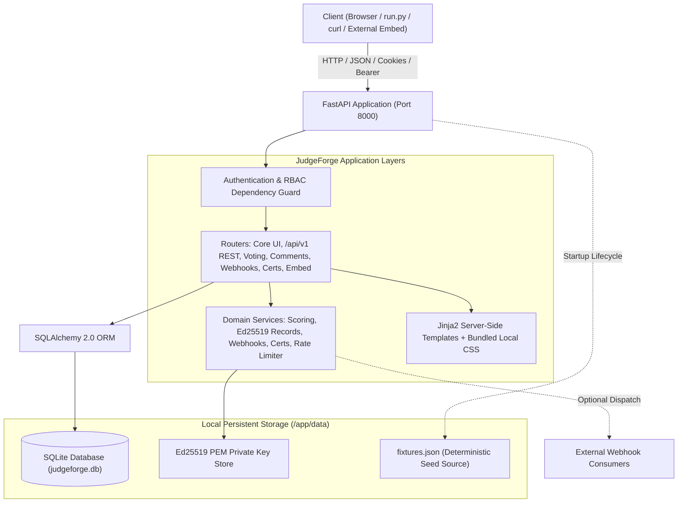
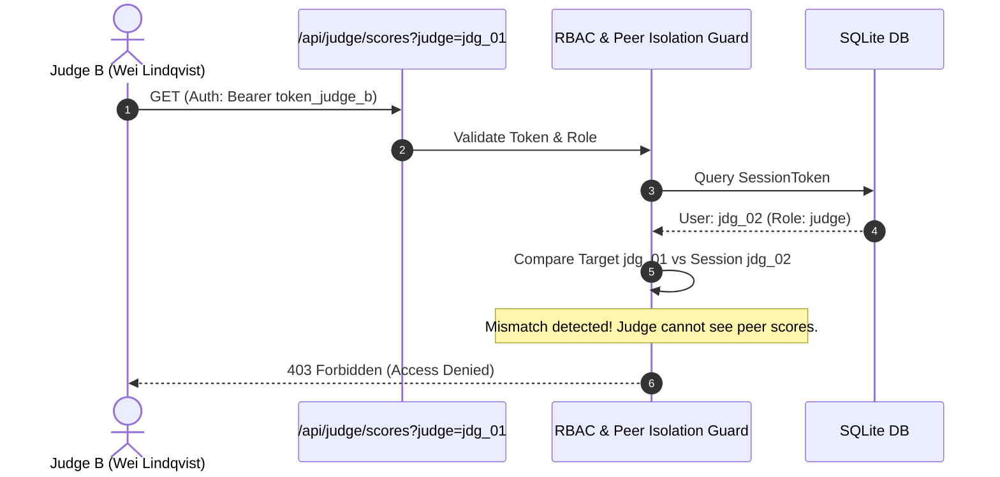

# JudgeForge Architecture

JudgeForge is designed for high reliability, minimal footprint, and zero cloud lock-in. It adheres strictly to the single-responsibility principle across routing, domain services, data persistence, and templating.

---

## 1. High-Level Architecture & End-to-End Flow

```
Browser / UI / API Client
       │
       ▼
 FastAPI Routes (HTML, Jinja2, /api/v1, /embed)
       │
       ▼
 RBAC & Security Boundaries (Admin, Organizer, Judge, Participant)
       │
       ▼
 Local SQLite Engine (Thread-safe SQLAlchemy 2.0, Persistent Volume)
       │
       ▼
 Domain Services (Scoring Normalization, Community Voting, Audit Logging, Ed25519 Records)
       │
       ▼
 Optional Local Webhook Delivery (HMAC-SHA256 Signed Outbound HTTP Dispatcher)
```



---

## 2. Request Flow & Security Boundaries

Every incoming request passes through the FastAPI dependency injection pipeline:

1. **Token Extraction**:
   - `extract_token_from_request` inspects the `Authorization` header for `Bearer <token>`.
   - If absent, it checks the `Cookie` header for `session=<token>`.
2. **Session Verification**:
   - The token is queried against `session_tokens` table in SQLite.
   - If matched, the associated `User` entity is loaded and attached to request context.
   - If invalid, `HTTPException(401)` is raised on protected endpoints.
3. **Role Enforcement (RBAC)**:
   - Dedicated dependencies (`require_admin`, `require_organizer`, `require_judge_or_organizer`, `require_participant_or_organizer`) inspect `user.role`.
   - Unauthorized attempts return `HTTPException(403)`.
4. **Judge Peer Isolation Guard**:
   - In judging endpoints (`/api/judge/scores`, `/api/v1/scores`), if a judge attempts to access reviews belonging to other judges or supplies a differing judge identifier, the server immediately rejects the request with `403 Forbidden`.
5. **Project Team Authorization & Event Validation**:
   - When a participant submits or modifies a project with `team_id`, the system verifies that the participant is an active `TeamMember` of that team (403 if not).
   - Validates that `team.event_id` matches the target project `event_id` (400 if mismatch).
   - Validates that `track_id` belongs to the target event (400 if mismatch).
6. **Team Member Privacy & Draft Protection**:
   - `GET /api/v1/teams` returns only public metadata (`id`, `name`, `event_id`, `member_count`, `submitted_project_count`), completely redacting emails and user IDs.
   - `GET /api/v1/teams/{id}` returns redacted information to anonymous callers and non-member participants, while exposing full member data and private draft projects only to authenticated team members, organizers, and admins.
7. **Verifiable Records Privacy Isolation**:
   - Publicly verifiable judge records (`/api/v1/verifiable-records/*`) verify judge participation and review integrity without leaking sensitive numeric criteria scores (`functionality`, `quality`, `innovation`), private comments, user IDs, or judge tokens.



---

## 3. Component Breakdown

### Core Foundation
- **`app/main.py`**:
  - Initializes FastAPI application instance.
  - Registers the lifespan context manager: database table initialization, schema migration, idempotent seeding from `fixtures.json`, and console output of demo tokens.
  - Mounts static files and registers all core UI, T3, and T4 routers.
- **`app/database.py`**:
  - Configures SQLite engine with thread safety (`check_same_thread=False`).
  - Provides database session generator `get_db()`.
- **`app/models.py`**:
  - Declarative SQLAlchemy models reflecting events, tracks, judges, teams, members, projects, rubric criteria, scores, session tokens, audit logs, community votes, vouchers, comments, rate limits, webhooks, and verifiable records.
- **`app/auth.py`**:
  - Implements header and cookie token extraction, user session creation, and declarative RBAC dependencies.
- **`app/seed.py`**:
  - Loads official `fixtures.json`.
  - Ensures idempotent creation: checks existing primary keys and emails before inserting records.
  - Creates deterministic tokens for testing and automation.

### T1 & T2 Feature Routers
- **`app/routers/health.py`**: Liveness check `GET /health`.
- **`app/routers/auth.py`**: Session login, registration, and logout endpoints.
- **`app/routers/projects.py`**: Public gallery (`GET /projects`), project detail view, deadline-enforced submissions (`POST /api/projects`), and project updates (`PUT /api/projects/{id}`).
- **`app/routers/judging.py`**: Protected judge score retrieval (`GET /api/judge/scores`) with peer isolation, scoring submission (`POST /api/judge/scores`), and judge portal HTML.
- **`app/routers/organizer.py`**: CSV export (`GET /api/export.csv`), leaderboard rankings, judging progress metrics, prize management, and rubric weight adjustments.
- **`app/routers/workflows.py`**: Workspace UI, team invitation tokens, draft management, and official results publication.
- **`app/services/scoring.py`**:
  - Domain service executing weighted scoring, judge statistics calculations, Z-score standardizations, zero-variance fallbacks, and CSV serialization.

### T3 Community & Moderation Modules
- **`app/rate_limiter.py`**:
  - SQLite-backed sliding-window rate limiter persisting request timestamps in `rate_limit_records` table with zero external caching dependencies (Redis/Memcached).
- **`app/routers/voting.py`**:
  - Dedicated community voting UI (`/events/{id}/vote`) and API (`POST /api/events/{id}/vote`).
  - Implements three configurable access modes: `open` (anonymous IP/cookie-tracked), `authenticated` (signed-in user), and `email_gated` (single-use voucher tokens from `voting_vouchers`).
  - Randomized ballot ordering per voter session to prevent presentation bias.
  - Voting-window results hiding: results remain hidden until the organizer marks `voting_results_public=1`.
- **`app/routers/comments.py`**:
  - Threaded public comments on projects (`POST /api/projects/{id}/comments`).
  - Content moderation: community flagging and organizer flag clearing or comment deletion (`DELETE /api/comments/{id}`).

### T4 Enterprise & Extensibility Services
- **`app/routers/api_v1.py`**:
  - Comprehensive REST API at `/api/v1` mirroring all UI capabilities (events, tracks, prizes, teams, projects, drafts, rubric, scoring, voting, comments, results).
  - Fully documented via FastAPI OpenAPI Swagger docs at `/docs` and `/openapi.json`.
- **`app/services/webhooks.py` & `app/routers/webhooks.py`**:
  - Outbound webhook dispatcher firing JSON event payloads (`project.created`, `project.submitted`, `results.published`, etc.).
  - Cryptographically signs payloads using HMAC-SHA256 delivered in the `X-JudgeForge-Signature-256` header.
  - Asynchronous non-blocking delivery logging HTTP status codes and responses to `webhook_delivery_logs`.
- **`app/services/certificates.py` & `app/routers/certificates.py`**:
  - Generates offline SVG award and participation certificates with unique SHA-256 integrity fingerprints.
  - Provides cryptographic fingerprint verification endpoint (`POST /api/v1/certificates/verify`).
- **`app/services/verifiable_records.py` & `app/routers/verifiable_records.py`**:
  - Generates tamper-evident, append-only hash chains over judging records.
  - Signs records using Ed25519 digital signatures (Curve25519 via Python `cryptography` library) with persistent PKCS8 PEM private key storage.
  - Exposes public verification key at `GET /api/v1/verifiable-records/public-key` and verification endpoint at `POST /api/v1/verifiable-records/verify-record`.
  - Guarantees judge score privacy: records prove participation and integrity without leaking numeric scores or private comments.
- **`app/routers/embed.py`**:
  - Responsive iframe embed routes (`/embed/gallery`, `/embed/projects/{id}`) with custom theme parameters (`light`, `dark`) for external website integration.
- **`app/routers/bulk_data.py`**:
  - Complete JSON export and restoration endpoints (`GET /api/v1/bulk/export`, `POST /api/v1/bulk/import`) enabling full portability across hackathon instances.

---

## 4. Container Strategy & Persistence

The platform runs inside a minimal `python:3.12-slim` container:
- Database files and cryptographic keys reside in `/app/data`, mounted to a persistent Docker named volume `judgeforge_data`.
- Non-destructive schema migrations run automatically on startup to maintain backwards compatibility without resetting data.
- Built-in container healthcheck executes `curl -f http://localhost:8000/health` every 10 seconds.
- Seeding runs on startup automatically if the database has not yet been seeded.
- Port 8000 is exposed and bound to host.
