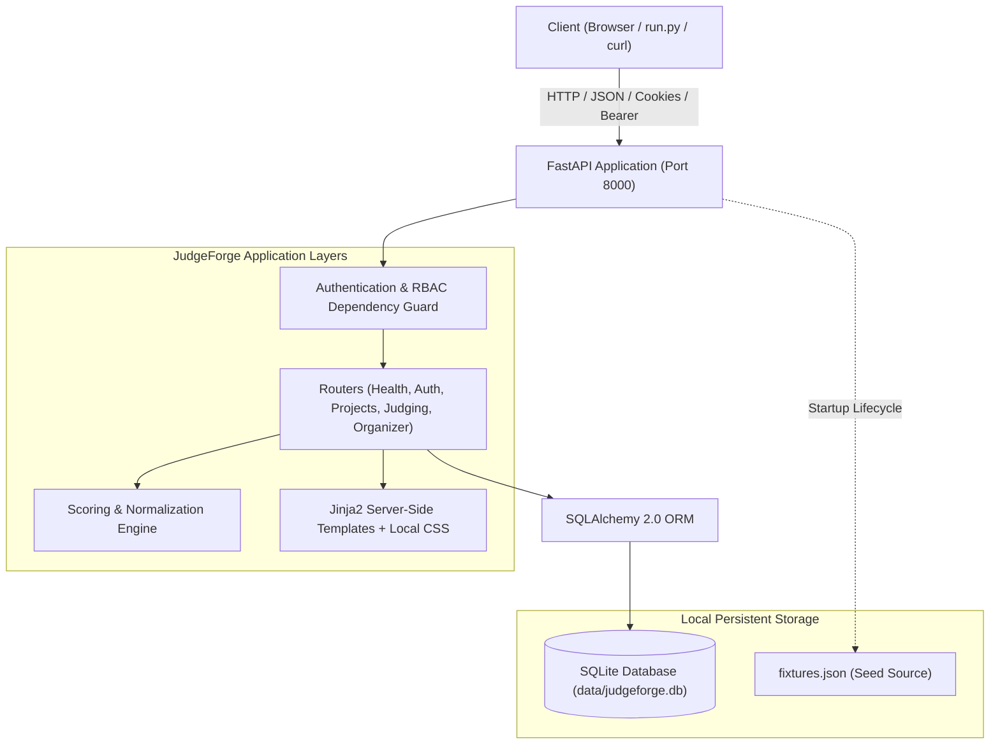
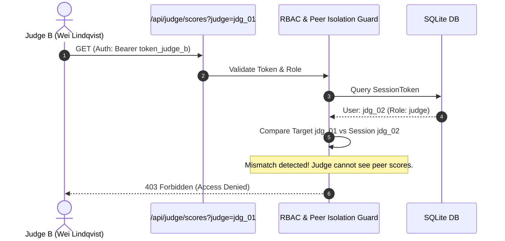

# JudgeForge Architecture

JudgeForge is designed for high reliability, minimal footprint, and zero cloud lock-in. It adheres strictly to the single-responsibility principle across routing, domain services, data persistence, and templating.

---

## 1. High-Level Architecture

---

## 2. Request Flow & Auth Resolution

Every incoming request passes through the FastAPI dependency injection pipeline:

1. **Token Extraction**:
   - `extract_token_from_request` inspects the `Authorization` header for `Bearer <token>`.
   - If absent, it checks the `Cookie` header for `session=<token>`.
2. **Session Verification**:
   - The token is queried against `session_tokens` table in SQLite.
   - If matched, the associated `User` entity is loaded and attached to request context.
   - If invalid or expired, `HTTPException(401)` is raised on protected endpoints.
3. **Role Enforcement (RBAC)**:
   - Dependencies like `require_organizer`, `require_judge_or_organizer`, and `require_participant_or_organizer` inspect `user.role`.
   - Unauthorized attempts return `HTTPException(403)`.
4. **Peer Isolation Guard**:
   - In `/api/judge/scores`, if a judge supplies a `judge` query parameter that differs from their assigned judge profile, the server immediately rejects the request with `403 Forbidden`.

---

## 3. Component Breakdown

- **`app/main.py`**:
  - Initializes FastAPI application instance.
  - Registers the lifespan context manager which ensures table creation, idempotent database seeding, and console output of demo tokens.
  - Mounts static files and routes.
- **`app/database.py`**:
  - Configures SQLite engine with thread safety for SQLite (`check_same_thread=False`).
  - Provides database session generator `get_db()`.
- **`app/models.py`**:
  - Declarative SQLAlchemy models reflecting events, tracks, judges, teams, members, projects, rubric criteria, scores, session tokens, and audit logs.
- **`app/auth.py`**:
  - Implements header and cookie token extraction, user session creation, and declarative RBAC dependencies.
- **`app/seed.py`**:
  - Loads official `fixtures.json`.
  - Ensures idempotent creation: checks existing primary keys and emails before inserting records.
  - Creates deterministic tokens for testing and automation.
- **`app/routers/`**:
  - `health.py`: Liveness check `GET /health`.
  - `auth.py`: Session login and logout endpoints.
  - `projects.py`: Public gallery (`GET /projects`), project detail view, deadline-enforced submissions (`POST /api/projects`), and project updates (`PUT /api/projects/{id}`).
  - `judging.py`: Protected judge score retrieval (`GET /api/judge/scores`) with peer isolation, scoring submission (`POST /api/judge/scores`), and judge portal HTML.
  - `organizer.py`: CSV export (`GET /api/export.csv`), leaderboard rankings, judging progress metrics, and rubric weight adjustments.
- **`app/services/scoring.py`**:
  - Domain service executing weighted scoring, judge statistics calculations, Z-score standardizations, zero-variance fallbacks, and CSV serialization.
- **`app/templates/` & `app/static/`**:
  - Jinja2 templates and local CSS styling. No external network requests are made.

---

## 4. Container Strategy

The platform runs inside a minimal `python:3.12-slim` container:
- Database files reside in `/app/data`, mounted to a persistent Docker named volume `judgeforge_data`.
- Seeding runs on startup automatically if the database has not yet been seeded.
- Port 8000 is exposed and bound to host.
