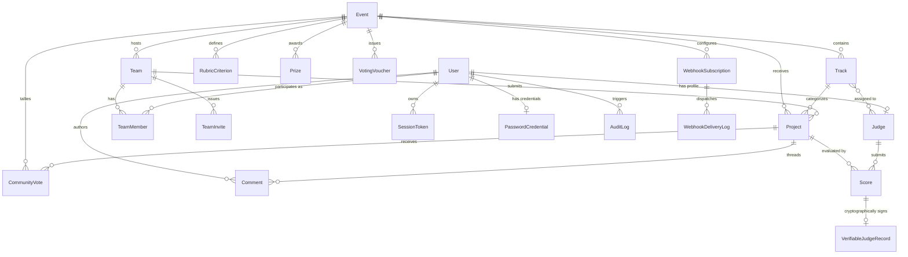

# JudgeForge Data Model

The JudgeForge schema is modeled in relational form using SQLAlchemy 2.0 with a persistent SQLite engine. It maps directly to hackathon domain concepts while supporting strict auditing, flexible rubric weighting, community voting, webhooks, and cryptographically verifiable evaluation.

---

## 1. Entity-Relationship Diagram

---

## 2. Table Definitions

### `users`
Represents authenticable actors on the platform.
| Column | Type | Constraints | Description |
|---|---|---|---|
| `id` | `VARCHAR` | PK | Unique user identifier (e.g. `usr_admin`, `usr_organizer`, `usr_jdg_01`) |
| `email` | `VARCHAR` | UNIQUE, NOT NULL, INDEX | User login and contact email |
| `name` | `VARCHAR` | NOT NULL | Display name |
| `role` | `VARCHAR` | NOT NULL, DEFAULT `'participant'` | Role: `admin`, `organizer`, `judge`, `participant` |
| `created_at` | `DATETIME` | NOT NULL | UTC account creation timestamp |

### `session_tokens`
Stores active session keys for Bearer and Cookie authentication.
| Column | Type | Constraints | Description |
|---|---|---|---|
| `token` | `VARCHAR` | PK, INDEX | Secret session string (e.g. `token_organizer`, `org_7f2a`) |
| `user_id` | `VARCHAR` | FK(`users.id`), NOT NULL, INDEX | References user |
| `created_at` | `DATETIME` | NOT NULL | UTC token issuance timestamp |

### `password_credentials`
Salted password storage supporting local email/password authentication.
| Column | Type | Constraints | Description |
|---|---|---|---|
| `user_id` | `VARCHAR` | PK, FK(`users.id`) | References user |
| `password_hash` | `VARCHAR` | NOT NULL | Salted PBKDF2-SHA256 password hash (600,000 iterations) |
| `demo` | `INTEGER` | NOT NULL, DEFAULT `0` | Boolean flag (0/1) indicating seeded demo account |

### `events`
Hackathon competition details, deadlines, and community voting configurations.
| Column | Type | Constraints | Description |
|---|---|---|---|
| `id` | `VARCHAR` | PK | Event identifier (e.g. `evt_01`) |
| `name` | `VARCHAR` | NOT NULL | Event title (e.g. `Sample Hack 2026`) |
| `submissions_close` | `DATETIME` | NOT NULL | UTC deadline after which submissions and edits are rejected |
| `created_at` | `DATETIME` | NOT NULL | UTC creation timestamp |
| `results_published` | `INTEGER` | NOT NULL, DEFAULT `0` | Boolean flag (0/1) controlling public visibility of official results |
| `results_published_at` | `DATETIME` | NULLABLE | UTC timestamp when results were officially announced |
| `voting_mode` | `VARCHAR` | NOT NULL, DEFAULT `'authenticated'` | Access mode: `'authenticated'`, `'email_gated'`, or `'open'` |
| `voting_opens` | `DATETIME` | NULLABLE | UTC opening timestamp for community voting |
| `voting_closes` | `DATETIME` | NULLABLE | UTC closing timestamp for community voting |
| `voting_results_public` | `INTEGER` | NOT NULL, DEFAULT `0` | Boolean flag (0/1) controlling visibility of community vote counts |

### `tracks`
Themed competition tracks.
| Column | Type | Constraints | Description |
|---|---|---|---|
| `id` | `VARCHAR` | PK | Track identifier (e.g. `trk_01`) |
| `event_id` | `VARCHAR` | FK(`events.id`), NOT NULL | Event association |
| `name` | `VARCHAR` | NOT NULL | Track name (e.g. `Developer tools`, `Climate`) |

### `judges`
Profile information and track assignments for evaluators.
| Column | Type | Constraints | Description |
|---|---|---|---|
| `id` | `VARCHAR` | PK | Judge identifier (e.g. `jdg_01`) |
| `user_id` | `VARCHAR` | FK(`users.id`), NULLABLE | Optional link to user login record |
| `name` | `VARCHAR` | NOT NULL | Judge name |
| `email` | `VARCHAR` | UNIQUE, NOT NULL, INDEX | Judge contact email |

### `judge_tracks`
Many-to-many association mapping judges to eligible tracks.
| Column | Type | Constraints | Description |
|---|---|---|---|
| `judge_id` | `VARCHAR` | FK(`judges.id`), PK | Judge identifier |
| `track_id` | `VARCHAR` | FK(`tracks.id`), PK | Track identifier |

### `teams`
Participant hacker teams.
| Column | Type | Constraints | Description |
|---|---|---|---|
| `id` | `VARCHAR` | PK | Team identifier (e.g. `tm_01`) |
| `event_id` | `VARCHAR` | FK(`events.id`), NOT NULL | Event association |
| `name` | `VARCHAR` | NOT NULL | Team name |
| `created_at` | `DATETIME` | NOT NULL | UTC creation timestamp |

### `team_members`
Association between teams and participant emails/users.
| Column | Type | Constraints | Description |
|---|---|---|---|
| `id` | `INTEGER` | PK, AUTOINCREMENT | Internal record identifier |
| `team_id` | `VARCHAR` | FK(`teams.id`), NOT NULL, INDEX | Team association |
| `email` | `VARCHAR` | NOT NULL, INDEX | Member email |
| `user_id` | `VARCHAR` | FK(`users.id`), NULLABLE | Optional link to user login |

### `team_invites`
Single-use time-limited invitation links for team onboarding.
| Column | Type | Constraints | Description |
|---|---|---|---|
| `token` | `VARCHAR` | PK | Secret random invitation token (48-hour validity) |
| `team_id` | `VARCHAR` | FK(`teams.id`), NOT NULL | Target team |
| `expires_at` | `DATETIME` | NOT NULL | UTC expiration timestamp |
| `used_by` | `VARCHAR` | NULLABLE | User ID of accepting participant |

### `projects`
Project submissions presented in the public gallery and evaluated by judges.
| Column | Type | Constraints | Description |
|---|---|---|---|
| `id` | `VARCHAR` | PK | Project identifier (e.g. `prj_01`) |
| `event_id` | `VARCHAR` | FK(`events.id`), NOT NULL, INDEX | Event association |
| `team_id` | `VARCHAR` | FK(`teams.id`), NOT NULL, INDEX | Submitting team |
| `track_id` | `VARCHAR` | FK(`tracks.id`), NOT NULL, INDEX | Assigned track |
| `title` | `VARCHAR` | NOT NULL | Project title |
| `summary` | `TEXT` | NULLABLE | Pitch and description |
| `repo_url` | `VARCHAR` | NULLABLE | Source code repository link |
| `status` | `VARCHAR` | NOT NULL, DEFAULT `'submitted'` | Status: `'draft'` or `'submitted'` |
| `submitted_at` | `DATETIME` | NOT NULL | UTC submission timestamp |

### `prizes`
Event awards, monetary prizes, and special recognitions.
| Column | Type | Constraints | Description |
|---|---|---|---|
| `id` | `VARCHAR` | PK | Prize identifier (e.g. `prz_01`) |
| `event_id` | `VARCHAR` | FK(`events.id`), NOT NULL, INDEX | Event association |
| `title` | `VARCHAR` | NOT NULL | Prize title (e.g. `1st Place Overall`) |
| `description` | `TEXT` | NULLABLE | Criteria and award description |
| `amount` | `VARCHAR` | NOT NULL | Monetary/reward value (e.g. `$5,000`) |
| `placement` | `VARCHAR` | NOT NULL | Placement or category (e.g. `1st`, `Special`) |
| `created_at` | `DATETIME` | NOT NULL | UTC creation timestamp |

### `rubric_criteria`
Configurable scoring dimensions and weights.
| Column | Type | Constraints | Description |
|---|---|---|---|
| `id` | `VARCHAR` | PK | Criterion identifier (e.g. `crit_func`) |
| `event_id` | `VARCHAR` | FK(`events.id`), NOT NULL | Event association |
| `name` | `VARCHAR` | NOT NULL | Key name: `functionality`, `quality`, `innovation` |
| `label` | `VARCHAR` | NOT NULL | User-facing display title |
| `description`| `TEXT` | NULLABLE | Guidance notes for judges |
| `weight` | `FLOAT` | NOT NULL, DEFAULT `1.0` | Weight multiplier for raw score calculation |
| `min_score` | `INTEGER` | NOT NULL, DEFAULT `1` | Lowest allowed rating |
| `max_score` | `INTEGER` | NOT NULL, DEFAULT `5` | Highest allowed rating |

### `scores`
Individual review evaluations submitted by judges.
| Column | Type | Constraints | Description |
|---|---|---|---|
| `id` | `INTEGER` | PK, AUTOINCREMENT | Internal record identifier |
| `judge_id` | `VARCHAR` | FK(`judges.id`), NOT NULL, INDEX | Reviewer identifier |
| `project_id`| `VARCHAR` | FK(`projects.id`), NOT NULL, INDEX | Evaluated project |
| `functionality` | `INTEGER` | NULLABLE | Rating for functionality (1-5) |
| `quality` | `INTEGER` | NULLABLE | Rating for quality (1-5) |
| `innovation`| `INTEGER` | NULLABLE | Rating for innovation (1-5) |
| `criteria_json` | `TEXT` | NULLABLE | Dynamic JSON representation of ratings |
| `comment` | `TEXT` | NULLABLE | Qualitative judge feedback |
| `submitted_at` | `DATETIME` | NOT NULL | UTC submission timestamp |

---

## 3. T3 Community & Moderation Tables

### `community_votes`
Ballots cast by community members during active voting windows.
| Column | Type | Constraints | Description |
|---|---|---|---|
| `id` | `INTEGER` | PK, AUTOINCREMENT | Internal vote identifier |
| `event_id` | `VARCHAR` | FK(`events.id`), NOT NULL, INDEX | Event association |
| `project_id` | `VARCHAR` | FK(`projects.id`), NOT NULL, INDEX | Voted project |
| `voter_identifier` | `VARCHAR` | NOT NULL, INDEX | Unique voter fingerprint (User ID, Voucher Token, or IP+Cookie hash) |
| `voter_type` | `VARCHAR` | NOT NULL | Voter type: `'authenticated'`, `'email_gated'`, or `'open'` |
| `voter_email` | `VARCHAR` | NULLABLE, INDEX | Email address for email-gated voting |
| `voter_ip` | `VARCHAR` | NULLABLE | Client IP address for rate limiting and fraud prevention |
| `created_at` | `DATETIME` | NOT NULL | UTC timestamp when ballot was cast |

### `voting_vouchers`
Single-use organizer-issued tokens for email-gated community voting.
| Column | Type | Constraints | Description |
|---|---|---|---|
| `token` | `VARCHAR` | PK, INDEX | Secret voucher string issued to approved voter email |
| `event_id` | `VARCHAR` | FK(`events.id`), NOT NULL, INDEX | Target event |
| `email` | `VARCHAR` | NOT NULL, INDEX | Authorized recipient email |
| `is_used` | `INTEGER` | NOT NULL, DEFAULT `0` | Boolean flag (0/1) indicating whether token was consumed |
| `created_at` | `DATETIME` | NOT NULL | UTC voucher creation timestamp |

### `comments`
Public discussion threads on submitted projects.
| Column | Type | Constraints | Description |
|---|---|---|---|
| `id` | `INTEGER` | PK, AUTOINCREMENT | Comment identifier |
| `project_id` | `VARCHAR` | FK(`projects.id`), NOT NULL, INDEX | Target project |
| `user_id` | `VARCHAR` | FK(`users.id`), NULLABLE | Optional author user reference |
| `author_name` | `VARCHAR` | NOT NULL | Display name of commenter |
| `content` | `TEXT` | NOT NULL | Comment markdown or text content |
| `is_flagged` | `INTEGER` | NOT NULL, DEFAULT `0` | Moderation flag (0 = approved, 1 = flagged for review) |
| `created_at` | `DATETIME` | NOT NULL | UTC creation timestamp |

### `rate_limit_records`
Persistent sliding-window rate limit tracking in SQLite with zero cache dependencies.
| Column | Type | Constraints | Description |
|---|---|---|---|
| `id` | `INTEGER` | PK, AUTOINCREMENT | Record identifier |
| `key` | `VARCHAR` | NOT NULL, INDEX | Action bucket key (e.g. `vote:127.0.0.1`, `comment:127.0.0.1`) |
| `timestamp` | `FLOAT` | NOT NULL, INDEX | Unix epoch timestamp of request |

---

## 4. T4 Enterprise & Verifiability Tables

### `webhook_subscriptions`
Configured outbound HTTP webhook endpoints.
| Column | Type | Constraints | Description |
|---|---|---|---|
| `id` | `VARCHAR` | PK, INDEX | Webhook identifier (e.g. `whk_abc123`) |
| `event_id` | `VARCHAR` | FK(`events.id`), NOT NULL, INDEX | Event association |
| `target_url` | `VARCHAR` | NOT NULL | Destination HTTPS/HTTP callback URL |
| `secret` | `VARCHAR` | NOT NULL | Shared secret used to generate HMAC-SHA256 signatures |
| `events_subscribed` | `VARCHAR` | NOT NULL, DEFAULT `'*'` | Comma-separated event topics or `'*'` for all |
| `is_active` | `INTEGER` | NOT NULL, DEFAULT `1` | Subscription status flag (1 = active, 0 = paused) |
| `created_at` | `DATETIME` | NOT NULL | UTC registration timestamp |

### `webhook_delivery_logs`
Audit history of outbound webhook dispatch attempts.
| Column | Type | Constraints | Description |
|---|---|---|---|
| `id` | `INTEGER` | PK, AUTOINCREMENT | Log entry identifier |
| `subscription_id` | `VARCHAR` | FK(`webhook_subscriptions.id`), NOT NULL, INDEX | Associated subscription |
| `event_type` | `VARCHAR` | NOT NULL | Triggering event topic (e.g. `project.submitted`) |
| `payload_json` | `TEXT` | NOT NULL | Exact serialized JSON dispatched |
| `status_code` | `INTEGER` | NULLABLE | HTTP response status returned by target |
| `response_body` | `TEXT` | NULLABLE | Truncated response body from target |
| `success` | `INTEGER` | NOT NULL, DEFAULT `0` | Delivery outcome flag (1 = 2xx success, 0 = failure) |
| `attempted_at` | `DATETIME` | NOT NULL | UTC dispatch timestamp |

### `verifiable_judge_records`
Tamper-evident, cryptographically signed ledger of judging participation.
| Column | Type | Constraints | Description |
|---|---|---|---|
| `id` | `INTEGER` | PK, AUTOINCREMENT | Record identifier |
| `score_id` | `INTEGER` | FK(`scores.id`), NOT NULL, INDEX | Associated review evaluation |
| `judge_id` | `VARCHAR` | NOT NULL, INDEX | Evaluating judge identifier |
| `project_id` | `VARCHAR` | NOT NULL, INDEX | Evaluated project identifier |
| `event_id` | `VARCHAR` | NOT NULL, INDEX | Competition event identifier |
| `record_hash` | `VARCHAR` | UNIQUE, NOT NULL, INDEX | SHA-256 hash of canonical record content + previous hash |
| `prev_hash` | `VARCHAR` | NOT NULL | Previous hash link in the event ledger chain (`"0"*64` for genesis) |
| `signature` | `VARCHAR` | NOT NULL | 128-character hex Ed25519 digital signature over `record_hash` |
| `created_at` | `DATETIME` | NOT NULL | UTC timestamp of record creation |

### `audit_logs`
Chronological append-only security and activity record.
| Column | Type | Constraints | Description |
|---|---|---|---|
| `id` | `INTEGER` | PK, AUTOINCREMENT | Log entry identifier |
| `user_id` | `VARCHAR` | NULLABLE, INDEX | Actor who performed the action |
| `action` | `VARCHAR` | NOT NULL | Action verb (e.g. `CREATE_PROJECT`, `SUBMIT_VOTE`, `FLAG_COMMENT`) |
| `target_type` | `VARCHAR` | NOT NULL | Entity type (e.g. `Score`, `Project`, `Comment`) |
| `target_id` | `VARCHAR` | NOT NULL | Target record identifier |
| `details` | `TEXT` | NULLABLE | Serialized event details and state changes |
| `created_at` | `DATETIME` | NOT NULL | UTC timestamp of event |

---

## 5. Offline Certificates (Non-Persisted by Design)

Certificates for winners, participants, and judges are generated on-demand as pure vector SVG artifacts:
- **No Database Bloat**: Generated programmatically from existing `events`, `teams`, `projects`, and `scores` data.
- **Cryptographic Fingerprint**: Every generated certificate embeds a canonical SHA-256 integrity fingerprint:
  $$\text{Fingerprint} = \text{SHA256}(\text{event\_id} + \text{type} + \text{recipient} + \text{title} + \text{secret\_seed})$$
- **Offline Verification**: Anyone can verify the authenticity and unaltered status of a certificate via `POST /api/v1/certificates/verify` by submitting the SVG file or its fingerprint string.

---

## 6. Portability & Bulk Import/Export Architecture

The data model is designed for complete offline portability:
1. **JSON Export (`GET /api/v1/bulk/export`)**:
   - Serializes complete competition datasets (`events`, `tracks`, `teams`, `team_members`, `projects`, `prizes`, `rubric_criteria`, `scores`) into a structured, validated JSON format.
2. **JSON Import (`POST /api/v1/bulk/import`)**:
   - Atomically ingests structured JSON backups into a fresh or existing database.
   - Enforces referential integrity by ordering inserts sequentially: Events $\to$ Tracks $\to$ Prizes $\to$ Rubric Criteria $\to$ Teams $\to$ Members $\to$ Projects $\to$ Scores.
   - Prevents duplicate primary key collisions and validates all foreign key constraints.
