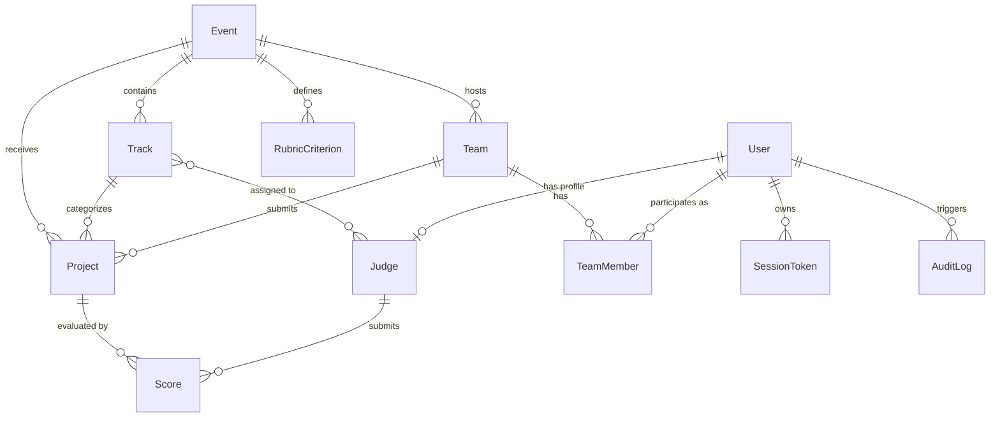

# JudgeForge Data Model

The JudgeForge schema is modeled in relational form using SQLAlchemy 2.0 with a persistent SQLite engine. It maps directly to hackathon domain concepts while supporting strict auditing, flexible rubric weighting, and isolated evaluation.

---

## 1. Entity-Relationship Diagram

---

## 2. Table Definitions

### `users`
Represents authenticable actors on the platform.
| Column | Type | Constraints | Description |
|---|---|---|---|
| `id` | `VARCHAR` | PK | Unique user identifier (e.g. `usr_organizer`, `usr_jdg_01`) |
| `email` | `VARCHAR` | UNIQUE, NOT NULL, INDEX | User login and contact email |
| `name` | `VARCHAR` | NOT NULL | Display name |
| `role` | `VARCHAR` | NOT NULL, DEFAULT `'participant'` | Role: `organizer`, `judge`, `participant`, `visitor` |
| `created_at` | `DATETIME` | NOT NULL | UTC account creation timestamp |

### `session_tokens`
Stores active session keys for Bearer and Cookie authentication.
| Column | Type | Constraints | Description |
|---|---|---|---|
| `token` | `VARCHAR` | PK, INDEX | Secret session string (e.g. `token_organizer`, `org_7f2a`) |
| `user_id` | `VARCHAR` | FK(`users.id`), NOT NULL, INDEX | References user |
| `created_at` | `DATETIME` | NOT NULL | UTC token issuance timestamp |

### `events`
Hackathon competition details and deadline configurations.
| Column | Type | Constraints | Description |
|---|---|---|---|
| `id` | `VARCHAR` | PK | Event identifier (e.g. `evt_01`) |
| `name` | `VARCHAR` | NOT NULL | Event title (e.g. `Sample Hack 2026`) |
| `submissions_close` | `DATETIME` | NOT NULL | UTC deadline after which submissions and edits are rejected |
| `created_at` | `DATETIME` | NOT NULL | UTC creation timestamp |

### `tracks`
Themed competition tracks.
| Column | Type | Constraints | Description |
|---|---|---|---|
| `id` | `VARCHAR` | PK | Track identifier (e.g. `trk_01`) |
| `event_id` | `VARCHAR` | FK(`events.id`), NOT NULL | Event association |
| `name` | `VARCHAR` | NOT NULL | Track name (e.g. `Developer tools`, `Climate`) |

### `judges`
Profile information and track assignments for evaluators.
| Column | Type | Constraints | Description |
|---|---|---|---|
| `id` | `VARCHAR` | PK | Judge identifier (e.g. `jdg_01`) |
| `user_id` | `VARCHAR` | FK(`users.id`), NULLABLE | Optional link to user login record |
| `name` | `VARCHAR` | NOT NULL | Judge name |
| `email` | `VARCHAR` | UNIQUE, NOT NULL, INDEX | Judge contact email |

### `judge_tracks`
Many-to-many association mapping judges to eligible tracks.
| Column | Type | Constraints | Description |
|---|---|---|---|
| `judge_id` | `VARCHAR` | FK(`judges.id`), PK | Judge identifier |
| `track_id` | `VARCHAR` | FK(`tracks.id`), PK | Track identifier |

### `teams`
Participant hacker teams.
| Column | Type | Constraints | Description |
|---|---|---|---|
| `id` | `VARCHAR` | PK | Team identifier (e.g. `tm_01`) |
| `event_id` | `VARCHAR` | FK(`events.id`), NOT NULL | Event association |
| `name` | `VARCHAR` | NOT NULL | Team name |
| `created_at` | `DATETIME` | NOT NULL | UTC creation timestamp |

### `team_members`
Association between teams and participant emails/users.
| Column | Type | Constraints | Description |
|---|---|---|---|
| `id` | `INTEGER` | PK, AUTOINCREMENT | Internal record identifier |
| `team_id` | `VARCHAR` | FK(`teams.id`), NOT NULL, INDEX | Team association |
| `email` | `VARCHAR` | NOT NULL, INDEX | Member email |
| `user_id` | `VARCHAR` | FK(`users.id`), NULLABLE | Optional link to user login |

### `projects`
Project submissions presented in the public gallery and evaluated by judges.
| Column | Type | Constraints | Description |
|---|---|---|---|
| `id` | `VARCHAR` | PK | Project identifier (e.g. `prj_01`) |
| `event_id` | `VARCHAR` | FK(`events.id`), NOT NULL, INDEX | Event association |
| `team_id` | `VARCHAR` | FK(`teams.id`), NOT NULL, INDEX | Submitting team |
| `track_id` | `VARCHAR` | FK(`tracks.id`), NOT NULL, INDEX | Assigned track |
| `title` | `VARCHAR` | NOT NULL | Project title |
| `summary` | `TEXT` | NULLABLE | Pitch and description |
| `repo_url` | `VARCHAR` | NULLABLE | Source code repository link |
| `submitted_at` | `DATETIME` | NOT NULL | UTC submission timestamp |

### `rubric_criteria`
Configurable scoring dimensions and weights.
| Column | Type | Constraints | Description |
|---|---|---|---|
| `id` | `VARCHAR` | PK | Criterion identifier (e.g. `crit_func`) |
| `event_id` | `VARCHAR` | FK(`events.id`), NOT NULL | Event association |
| `name` | `VARCHAR` | NOT NULL | Key name: `functionality`, `quality`, `innovation` |
| `label` | `VARCHAR` | NOT NULL | User-facing display title |
| `description`| `TEXT` | NULLABLE | Guidance notes for judges |
| `weight` | `FLOAT` | NOT NULL, DEFAULT `1.0` | Weight multiplier for raw score calculation |
| `min_score` | `INTEGER` | NOT NULL, DEFAULT `1` | Lowest allowed rating |
| `max_score` | `INTEGER` | NOT NULL, DEFAULT `5` | Highest allowed rating |

### `scores`
Individual review evaluations submitted by judges.
| Column | Type | Constraints | Description |
|---|---|---|---|
| `id` | `INTEGER` | PK, AUTOINCREMENT | Internal record identifier |
| `judge_id` | `VARCHAR` | FK(`judges.id`), NOT NULL, INDEX | Reviewer identifier |
| `project_id`| `VARCHAR` | FK(`projects.id`), NOT NULL, INDEX | Evaluated project |
| `functionality` | `INTEGER` | NULLABLE | Rating for functionality (1-5) |
| `quality` | `INTEGER` | NULLABLE | Rating for quality (1-5) |
| `innovation`| `INTEGER` | NULLABLE | Rating for innovation (1-5) |
| `criteria_json` | `TEXT` | NULLABLE | Dynamic JSON representation of ratings |
| `comment` | `TEXT` | NULLABLE | Qualitative judge feedback |
| `submitted_at` | `DATETIME` | NOT NULL | UTC submission timestamp |

### `audit_logs`
Chronological append-only security and activity record.
| Column | Type | Constraints | Description |
|---|---|---|---|
| `id` | `INTEGER` | PK, AUTOINCREMENT | Log entry identifier |
| `user_id` | `VARCHAR` | NULLABLE, INDEX | Actor who performed the action |
| `action` | `VARCHAR` | NOT NULL | Action verb (e.g. `CREATE_PROJECT`, `UPDATE_SCORE`) |
| `target_type` | `VARCHAR` | NOT NULL | Entity type (e.g. `Score`, `Project`) |
| `target_id` | `VARCHAR` | NOT NULL | Target record identifier |
| `details` | `TEXT` | NULLABLE | Serialized event details |
| `created_at` | `DATETIME` | NOT NULL | UTC timestamp of event |

---

## 3. Data Integrity & Edge Cases

1. **Duplicate Team Submissions**:
   - In `fixtures.json`, team `tm_07` has two submissions: `prj_07` ("Dry Harbour", 04:29 UTC) and `prj_41` ("Dry Harbour", 17:57 UTC).
   - Both are preserved as distinct project records with unique primary keys so that review histories and timestamps remain verifiable.
2. **Missing Reviews**:
   - Projects receive varying review counts (from 1 to 5). Normalization handles unequal sample sizes without biasing final project rankings.
3. **Idempotence**:
   - The seed loader checks for the existence of records by primary key (`id`) and unique fields (`email`) before issuing inserts. Rerunning `seed_database()` does not produce duplicates or foreign key collisions.
